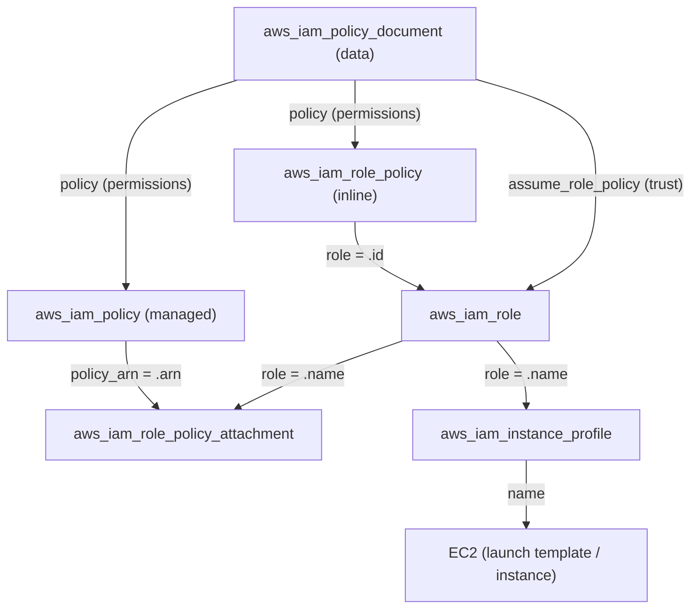

# AWS IAM trong Terraform — Tài liệu tổng hợp

Tài liệu này giải thích **toàn bộ** các resource và data source liên quan đến AWS IAM
trong Terraform AWS Provider: chúng là gì, dùng khi nào, và **liên hệ với nhau ra sao**.
Bao gồm cả những resource không xuất hiện trong codebase này.

> Mục tiêu: đọc xong là nắm được bức tranh đầy đủ về IAM trong Terraform, biết chọn
> đúng resource cho từng tình huống, và hiểu vì sao chúng được tách thành nhiều resource.

---

## Mục lục

1. [Khái niệm nền tảng](#1-khái-niệm-nền-tảng)
2. [Bản đồ tổng quan](#2-bản-đồ-tổng-quan)
3. [`aws_iam_policy_document` — viết policy bằng HCL](#3-aws_iam_policy_document--viết-policy-bằng-hcl)
4. [Identities: role, user, group](#4-identities-role-user-group)
5. [Policies: managed vs inline](#5-policies-managed-vs-inline)
6. [Attachments: gắn managed policy vào identity](#6-attachments-gắn-managed-policy-vào-identity)
7. [`aws_iam_instance_profile` — cầu nối role ↔ EC2](#7-aws_iam_instance_profile--cầu-nối-role--ec2)
8. [Group membership — gắn user vào group](#8-group-membership--gắn-user-vào-group)
9. [Credentials: access key, mật khẩu, MFA](#9-credentials-access-key-mật-khẩu-mfa)
10. [Identity providers: OIDC & SAML](#10-identity-providers-oidc--saml)
11. [Resource cấp tài khoản](#11-resource-cấp-tài-khoản)
12. [Service-linked role & server certificate](#12-service-linked-role--server-certificate)
13. [Resource "exclusive" (provider v5.59+)](#13-resource-exclusive-provider-v559)
14. [Data sources hữu ích](#14-data-sources-hữu-ích)
15. [Bảng quyết định: dùng cái nào?](#15-bảng-quyết-định-dùng-cái-nào)
16. [Best practices & bẫy thường gặp](#16-best-practices--bẫy-thường-gặp)
17. [Ví dụ end-to-end (từ codebase)](#17-ví-dụ-end-to-end-từ-codebase)

---

## 1. Khái niệm nền tảng

Trước khi đi vào từng resource, cần nắm 4 khái niệm cốt lõi của IAM:

| Khái niệm | Ý nghĩa |
|---|---|
| **Principal** | Thực thể *thực hiện* hành động: user, role, dịch vụ AWS (vd `ec2.amazonaws.com`), tài khoản khác. |
| **Identity** | Thực thể có thể *mang quyền*: **user**, **group**, **role**. |
| **Policy** | Tài liệu JSON mô tả **được/không được phép** làm gì. |
| **Statement** | Một mệnh đề trong policy: `Effect` (Allow/Deny) + `Action` + `Resource` (+ `Principal`, `Condition`). |

### Hai trục phân loại policy (rất hay nhầm)

Đây là chìa khóa hiểu toàn bộ IAM. Một policy được phân loại theo **hai trục độc lập**:

**Trục A — theo VAI TRÒ (policy để làm gì?):**
- **Trust policy** (*resource-based* trên role): quy định **ai được assume role** — có khối `Principal`, action `sts:AssumeRole`.
- **Permissions / Identity policy**: quy định **identity được làm gì** — có `Action` + `Resource`.

**Trục B — theo CÁCH LƯU TRỮ (policy được quản lý ra sao?):**
- **Inline policy**: nhúng thẳng vào **một** identity, không có ARN, sống/chết cùng identity.
- **Managed policy**: là **đối tượng độc lập có ARN**, đính kèm được cho **nhiều** identity.
  - *AWS managed*: AWS tạo sẵn (vd `AmazonS3ReadOnlyAccess`).
  - *Customer managed*: bạn tự tạo (`aws_iam_policy`).

> ⚠️ "Managed" KHÔNG phải loại policy thứ ba ngang hàng với "trust/permissions".
> Trust/permissions là **vai trò**; inline/managed là **hình thức lưu trữ**. Hai trục cắt nhau:
>
> |              | Inline                 | Managed                                   |
> |--------------|------------------------|-------------------------------------------|
> | **Permissions** | `aws_iam_role_policy`  | `aws_iam_policy` + `..._policy_attachment` |
> | **Trust**       | `assume_role_policy` (luôn inline) | ✗ không tồn tại |
>
> Trust policy **luôn** là inline trên role — không bao giờ là managed, vì nó gắn 1–1 với đúng một role.

---

## 2. Bản đồ tổng quan

```
                         ┌───────────────────────────────────┐
                         │   aws_iam_policy_document (data)   │
                         │   → sinh ra JSON cho mọi policy    │
                         └───────────────┬───────────────────┘
                                         │ .json
            ┌────────────────────────────┼────────────────────────────┐
            │ (trust)                     │ (permissions)               │ (permissions)
            ▼                             ▼                             ▼
   assume_role_policy            aws_iam_role_policy            aws_iam_policy
   (field của role)              (inline, 1 role)               (managed, có ARN)
            │                             │                             │
            ▼                             ▼                       policy_arn
   ┌─────────────────┐                    │              ┌──────────────┴───────────────┐
   │  aws_iam_role   │◄───────────────────┘              │ aws_iam_role_policy_attachment│
   │  aws_iam_user   │◄─────────────────────────────────►│ aws_iam_user_policy_attachment│
   │  aws_iam_group  │   (gắn managed policy vào identity)│ aws_iam_group_policy_attachment│
   └────────┬────────┘                                    └──────────────────────────────┘
            │ role
            ▼
   ┌──────────────────────────┐
   │ aws_iam_instance_profile │ ──► EC2 (qua launch template / instance)
   └──────────────────────────┘

   Group ◄── aws_iam_group_membership / aws_iam_user_group_membership ──► User
   User  ──► aws_iam_access_key / aws_iam_user_login_profile / aws_iam_virtual_mfa_device
   Federation: aws_iam_openid_connect_provider · aws_iam_saml_provider
   Account:    aws_iam_account_password_policy · aws_iam_account_alias · aws_iam_service_linked_role
```

---

## 3. `aws_iam_policy_document` — viết policy bằng HCL

**Đây là một data source, không phải resource** — nó không tạo gì trên AWS, chỉ **biên dịch** các khối HCL thành chuỗi JSON hợp lệ để các resource khác dùng (qua thuộc tính `.json`).

```hcl
data "aws_iam_policy_document" "example" {
  statement {
    sid       = "AllowReadLogs"
    effect    = "Allow"               # Allow | Deny (mặc định Allow)
    actions   = ["logs:GetLogEvents", "logs:DescribeLogGroups"]
    resources = ["*"]

    condition {
      test     = "StringEquals"
      variable = "aws:RequestedRegion"
      values   = ["us-west-2"]
    }
  }
}
```

**Vì sao nên dùng nó thay vì viết JSON tay (`jsonencode`)?**
- Validate cú pháp lúc `plan`, khó sai chính tả key.
- Hỗ trợ `condition`, `principals`, `not_actions`, `not_resources` rõ ràng.
- `source_policy_documents` / `override_policy_documents` để **ghép/đè** nhiều document.
- Tự nội suy biến Terraform (ARN, account id…) sạch sẽ.

**Hai "hình dạng" thường gặp:**

```hcl
# (a) TRUST policy — có principals + sts:AssumeRole
data "aws_iam_policy_document" "assume_role" {
  statement {
    actions = ["sts:AssumeRole"]
    principals {
      type        = "Service"
      identifiers = ["ec2.amazonaws.com"]
    }
  }
}

# (b) PERMISSIONS policy — có actions + resources, KHÔNG có principals
data "aws_iam_policy_document" "permissions" {
  statement {
    effect    = "Allow"
    actions   = ["logs:*"]
    resources = ["*"]
  }
}
```

> Mẹo phân biệt: thấy `principals` → trust policy; thấy `resources` mà không có `principals` → permissions policy.

---

## 4. Identities: role, user, group

### `aws_iam_role`

Danh tính **được assume tạm thời** bởi dịch vụ AWS, user, hoặc account khác. Dùng cho:
EC2 (qua instance profile), Lambda, ECS task, cross-account, federation…

```hcl
resource "aws_iam_role" "example" {
  name = "my-role"

  # BẮT BUỘC — trust policy, quy định AI được assume role này
  assume_role_policy = data.aws_iam_policy_document.assume_role.json

  max_session_duration = 3600          # 1–12 giờ
  permissions_boundary = aws_iam_policy.boundary.arn  # (tùy chọn) trần quyền tối đa
  path                 = "/"
  tags                 = { Team = "platform" }
}
```

Điểm cốt lõi:
- `assume_role_policy` là **field bắt buộc** — role không tồn tại nếu thiếu (quan hệ 1–1).
- `managed_policy_arns` và khối `inline_policy {}` **vẫn tồn tại nhưng đã DEPRECATED** (v5+) — đừng dùng, hãy tách ra resource riêng (xem §5, §6).

### `aws_iam_user`

Danh tính **lâu dài** cho con người hoặc ứng dụng cũ (không assume role được). Hạn chế tạo
user khi có thể dùng role/federation.

```hcl
resource "aws_iam_user" "alice" {
  name          = "alice"
  path          = "/"
  force_destroy = true     # xóa cả access key/policy đính kèm khi destroy
  tags          = { Email = "alice@example.com" }
}
```

### `aws_iam_group`

Tập hợp user để gán quyền chung. **Group không phải principal** — không assume được,
chỉ là phương tiện gom user lại để cấp quyền.

```hcl
resource "aws_iam_group" "developers" {
  name = "developers"
  path = "/"
}
```

---

## 5. Policies: managed vs inline

### `aws_iam_policy` — customer managed policy (có ARN)

Tạo một **đối tượng policy độc lập**, tái sử dụng được cho nhiều identity.

```hcl
resource "aws_iam_policy" "read_logs" {
  name        = "read-logs"
  description = "Cho phép đọc CloudWatch Logs"
  policy      = data.aws_iam_policy_document.permissions.json
  tags        = { Team = "platform" }
}
# Xuất ra: aws_iam_policy.read_logs.arn  ← dùng để attach
```

### Inline policy — nhúng vào đúng một identity

Mỗi loại identity có resource inline riêng. Inline policy **không có ARN**, gắn chặt và
sống/chết cùng identity, **không tái sử dụng** được:

| Identity | Resource inline |
|---|---|
| Role  | `aws_iam_role_policy` |
| User  | `aws_iam_user_policy` |
| Group | `aws_iam_group_policy` |

```hcl
resource "aws_iam_role_policy" "inline_perms" {
  name   = "read-logs"
  role   = aws_iam_role.example.id          # tham chiếu trực tiếp identity
  policy = data.aws_iam_policy_document.permissions.json
}
```

### Managed vs Inline — chọn cái nào?

| Tiêu chí | Inline (`aws_iam_role_policy`) | Managed (`aws_iam_policy` + attachment) |
|---|---|---|
| Có ARN, tồn tại độc lập | Không | Có |
| Tái sử dụng nhiều identity | Không | Có |
| Số resource Terraform | 1 | 2 |
| Vòng đời | gắn chặt identity | độc lập |
| Hỗ trợ tags | Không | Có |
| Phù hợp khi | quyền **riêng** cho 1 identity | quyền **dùng chung** nhiều identity |

> Quy tắc nhanh: quyền chỉ dùng cho **một** identity → inline cho gọn. Cần **chia sẻ** → managed.

---

## 6. Attachments: gắn managed policy vào identity

Managed policy là đối tượng độc lập, nên cần một **"bảng nối"** để gắn vào identity.
Đây là quan hệ **nhiều–nhiều** (1 policy ↔ nhiều identity, 1 identity ↔ nhiều policy).

| Identity | Resource attach (non-exclusive) |
|---|---|
| Role  | `aws_iam_role_policy_attachment` |
| User  | `aws_iam_user_policy_attachment` |
| Group | `aws_iam_group_policy_attachment` |

```hcl
resource "aws_iam_role_policy_attachment" "example" {
  role       = aws_iam_role.example.name
  policy_arn = aws_iam_policy.read_logs.arn
}

# Gắn cả AWS managed policy có sẵn:
resource "aws_iam_role_policy_attachment" "ssm" {
  role       = aws_iam_role.example.name
  policy_arn = "arn:aws:iam::aws:policy/AmazonSSMManagedInstanceCore"
}
```

Các resource attach trên là **non-exclusive**: chỉ quản lý đúng liên kết đó, không gỡ
các policy khác đang gắn trên cùng identity.

### ⚠️ `aws_iam_policy_attachment` (số ít) — LEGACY, tránh dùng

Resource này gắn **một** policy vào **danh sách** users/roles/groups và quản lý
**ĐỘC QUYỀN** — nó sẽ **gỡ mọi liên kết khác** của policy đó. Rất dễ gây sự cố khi nhiều
nơi cùng dùng policy. **Hầu như luôn nên dùng `aws_iam_*_policy_attachment` (số nhiều theo
identity) thay thế.**

---

## 7. `aws_iam_instance_profile` — cầu nối role ↔ EC2

EC2 instance **không gắn role trực tiếp** — phải qua một **instance profile** bọc lấy role.
Một instance profile chứa **đúng một role**.

```hcl
resource "aws_iam_instance_profile" "example" {
  name = "webserver-profile"
  role = aws_iam_role.example.name
}
# Dùng trong launch template / instance:
#   iam_instance_profile { name = aws_iam_instance_profile.example.name }
```

Luồng đầy đủ: `policy_document → role (+ permissions) → instance_profile → EC2`.
Dịch vụ EC2 *assume* role (nhờ trust policy) rồi instance mang quyền của role.

---

## 8. Group membership — gắn user vào group

Có **hai cách**, khác nhau ở tính độc quyền — đây là chỗ rất hay nhầm:

```hcl
# (a) NON-EXCLUSIVE — gắn MỘT user vào nhiều group (khuyến nghị)
resource "aws_iam_user_group_membership" "alice" {
  user   = aws_iam_user.alice.name
  groups = [aws_iam_group.developers.name, aws_iam_group.admins.name]
}

# (b) EXCLUSIVE — quản lý TOÀN BỘ thành viên của MỘT group
resource "aws_iam_group_membership" "team" {
  name  = "team-membership"
  group = aws_iam_group.developers.name
  users = [aws_iam_user.alice.name, aws_iam_user.bob.name]
  # ⚠️ user nào không nằm trong list này sẽ bị GỠ khỏi group
}
```

| | `aws_iam_user_group_membership` | `aws_iam_group_membership` |
|---|---|---|
| Góc nhìn | từ **user** | từ **group** |
| Độc quyền | Không | **Có** (gỡ user ngoài list) |
| Phù hợp | thường ngày | khi muốn kiểm soát tuyệt đối 1 group |

---

## 9. Credentials: access key, mật khẩu, MFA

| Resource | Dùng để |
|---|---|
| `aws_iam_access_key` | Tạo access key/secret cho **user** (lập trình/CLI). Output `secret` nhạy cảm — nên mã hóa bằng `pgp_key` hoặc đưa vào secret manager. |
| `aws_iam_user_login_profile` | Tạo **mật khẩu đăng nhập Console** cho user. |
| `aws_iam_virtual_mfa_device` | Thiết bị MFA ảo (TOTP). |
| `aws_iam_service_specific_credential` | Credential riêng cho dịch vụ (vd CodeCommit Git). |
| `aws_iam_signing_certificate` | Chứng chỉ ký cho API SOAP cũ. |

```hcl
resource "aws_iam_access_key" "alice" {
  user = aws_iam_user.alice.name
}
# aws_iam_access_key.alice.id     → Access Key ID
# aws_iam_access_key.alice.secret → Secret (sensitive!)
```

> ⚠️ Tránh đưa secret vào state/output không mã hóa. Ưu tiên role/federation thay vì
> access key tĩnh.

---

## 10. Identity providers: OIDC & SAML

Cho phép identity **bên ngoài** AWS assume role (federation) — không cần tạo IAM user.

### `aws_iam_openid_connect_provider` (OIDC)
Dùng cho GitHub Actions, GitLab, EKS IRSA, Kubernetes…

```hcl
resource "aws_iam_openid_connect_provider" "github" {
  url             = "https://token.actions.githubusercontent.com"
  client_id_list  = ["sts.amazonaws.com"]
  thumbprint_list = ["6938fd4d98bab03faadb97b34396831e3780aea1"]
}
```
Sau đó tạo role với trust policy kiểu `Federated` trỏ tới ARN provider, kèm `condition`
khớp `sub`/`aud` — để vd một workflow GitHub assume role mà không cần access key.

### `aws_iam_saml_provider` (SAML 2.0)
Dùng cho SSO doanh nghiệp (Okta, AD FS, Azure AD…).

```hcl
resource "aws_iam_saml_provider" "okta" {
  name                   = "okta"
  saml_metadata_document = file("okta-metadata.xml")
}
```

---

## 11. Resource cấp tài khoản

Các resource ảnh hưởng **toàn bộ AWS account** (chỉ nên có một, thường ở stack quản trị):

| Resource | Tác dụng |
|---|---|
| `aws_iam_account_password_policy` | Quy định độ mạnh mật khẩu cho mọi IAM user (độ dài, ký tự, xoay vòng…). |
| `aws_iam_account_alias` | Đặt bí danh cho URL đăng nhập (`https://<alias>.signin.aws.amazon.com/console`). |

```hcl
resource "aws_iam_account_password_policy" "strict" {
  minimum_password_length = 14
  require_symbols         = true
  require_numbers         = true
  max_password_age        = 90
}
```

---

## 12. Service-linked role & server certificate

### `aws_iam_service_linked_role`
Một số dịch vụ AWS (ECS, ELB, autoscaling…) cần role đặc biệt do AWS định nghĩa sẵn.
Tạo bằng tên dịch vụ thay vì tự viết policy.

```hcl
resource "aws_iam_service_linked_role" "es" {
  aws_service_name = "opensearchservice.amazonaws.com"
}
```

### `aws_iam_server_certificate`
Upload chứng chỉ TLS vào IAM để ELB Classic / CloudFront dùng (khu vực không có ACM).

```hcl
resource "aws_iam_server_certificate" "example" {
  name             = "my-cert"
  certificate_body = file("cert.pem")
  private_key      = file("key.pem")
}
```

---

## 13. Resource "exclusive" (provider v5.59+)

Nhóm resource mới giúp **kiểm soát tuyệt đối** tập policy trên một identity một cách
*khai báo* (declarative) — phát hiện và loại bỏ policy "lạ" gắn ngoài Terraform, nhưng
**không** tự tạo policy. Dùng khi cần chống drift nghiêm ngặt.

| Resource | Quản lý độc quyền |
|---|---|
| `aws_iam_role_policy_attachments_exclusive` | toàn bộ **managed** policy gắn vào role |
| `aws_iam_role_policies_exclusive` | toàn bộ **inline** policy của role |
| `aws_iam_user_policy_attachments_exclusive` / `aws_iam_user_policies_exclusive` | tương tự cho user |
| `aws_iam_group_policy_attachments_exclusive` / `aws_iam_group_policies_exclusive` | tương tự cho group |

```hcl
resource "aws_iam_role_policy_attachments_exclusive" "example" {
  role_name   = aws_iam_role.example.name
  policy_arns = [aws_iam_policy.read_logs.arn]   # CHỈ những ARN này được phép tồn tại
}
```

> Đây là cách thay thế "đúng đắn" cho `managed_policy_arns`/`inline_policy` đã deprecated
> khi bạn *thực sự* muốn hành vi độc quyền, nhưng vẫn giữ attachment ở resource riêng.

---

## 14. Data sources hữu ích

Dùng để **tra cứu** tài nguyên có sẵn thay vì tạo mới:

| Data source | Trả về |
|---|---|
| `aws_iam_policy_document` | JSON policy (xem §3) — quan trọng nhất |
| `aws_iam_policy` | tra cứu managed policy (kể cả AWS managed) theo `name`/`arn` |
| `aws_iam_role` | thông tin role có sẵn |
| `aws_iam_user` / `aws_iam_group` | thông tin user/group |
| `aws_iam_session_context` | role thật đằng sau một assumed-role ARN |
| `aws_iam_openid_connect_provider` / `aws_iam_saml_provider` | provider federation có sẵn |
| `aws_caller_identity` · `aws_partition` · `aws_region` | (không thuộc IAM nhưng hay đi kèm) account id, partition, region để ghép ARN |

```hcl
data "aws_iam_policy" "admin" {
  arn = "arn:aws:iam::aws:policy/AdministratorAccess"
}
data "aws_caller_identity" "current" {}
# data.aws_caller_identity.current.account_id → dùng để build ARN
```

---

## 15. Bảng quyết định: dùng cái nào?

| Tôi muốn… | Dùng |
|---|---|
| Viết nội dung policy | `data.aws_iam_policy_document` |
| Role cho EC2/Lambda/ECS | `aws_iam_role` (+ `assume_role_policy`) |
| Cấp quyền **riêng** cho 1 role | `aws_iam_role_policy` (inline) |
| Cấp quyền **dùng chung** nhiều identity | `aws_iam_policy` + `aws_iam_role_policy_attachment` |
| Gắn AWS managed policy có sẵn | `aws_iam_role_policy_attachment` (với ARN `arn:aws:iam::aws:policy/...`) |
| Cho EC2 dùng role | `aws_iam_instance_profile` |
| User cho con người/CLI | `aws_iam_user` (+ `aws_iam_access_key` / login profile) |
| Gom user cấp quyền chung | `aws_iam_group` + membership |
| Cho GitHub Actions / EKS assume role | `aws_iam_openid_connect_provider` + role federation |
| SSO doanh nghiệp | `aws_iam_saml_provider` |
| Ép tập policy tuyệt đối (chống drift) | `aws_iam_*_exclusive` (v5.59+) |

---

## 16. Best practices & bẫy thường gặp

**Nên:**
- Dùng `aws_iam_policy_document` thay vì JSON tay → bắt lỗi sớm, dễ ghép.
- **Least privilege**: liệt kê `actions`/`resources` cụ thể thay vì `*` khi có thể.
- Ưu tiên **role + federation** hơn IAM user + access key tĩnh.
- Đặt tên duy nhất (vd `${namespace}-${label}-role`) khi module được dùng nhiều lần,
  hoặc dùng `name_prefix` + `create_before_destroy` để thay thế không trùng tên.
- Tách permissions ra **resource riêng** (`aws_iam_role_policy` hoặc managed + attachment).

**Tránh / bẫy:**
- ❌ **`inline_policy {}` và `managed_policy_arns` trong `aws_iam_role`** → đã *deprecated*
  và quản lý **độc quyền**: chúng sẽ gỡ mọi policy gắn từ nơi khác → drift. Tách ra resource riêng.
- ❌ **Trộn** `inline_policy {}` (trong role) với `aws_iam_role_policy` (resource riêng) cho
  cùng role → đánh nhau, ghi đè mỗi lần apply. (Giống y hệt bẫy *security group* inline vs
  standalone rule.)
- ❌ **`aws_iam_policy_attachment` (số ít)** → độc quyền toàn cục, dễ gỡ nhầm liên kết của
  người khác. Dùng `aws_iam_role_policy_attachment` (theo identity) thay thế.
- ❌ Để **secret** của `aws_iam_access_key` lộ trong state/output không mã hóa.
- ❌ Quên rằng EC2 cần **instance profile**, không gắn role trực tiếp.

**Vì sao IAM bị tách thành nhiều resource?** Vì nó phản ánh chính **AWS API**:
- Trust policy là tham số *bên trong* `iam:CreateRole` → là field `assume_role_policy`.
- Managed policy là đối tượng riêng (`iam:CreatePolicy`, có ARN) và việc gắn là lời gọi
  riêng (`iam:AttachRolePolicy`) → cần 2 resource. Quan hệ nhiều–nhiều luôn cần "bảng nối".
- Inline policy có API riêng (`iam:PutRolePolicy`) gắn 1 role → 1 resource là đủ.

---

## 17. Ví dụ end-to-end (từ codebase)

Trích từ [`modules/autoscaling/main.tf`](../modules/autoscaling/main.tf) — tạo role cho
webserver EC2 với quyền ghi CloudWatch Logs (bản **managed**):

```hcl
# 1) TRUST: cho dịch vụ EC2 assume role
data "aws_iam_policy_document" "assume_role" {
  statement {
    actions = ["sts:AssumeRole"]
    principals {
      type        = "Service"
      identifiers = ["ec2.amazonaws.com"]
    }
  }
}

# 2) PERMISSIONS: được làm gì
data "aws_iam_policy_document" "permissions" {
  statement {
    effect    = "Allow"
    actions   = ["logs:*"]
    resources = ["*"]
  }
}

# 3) ROLE (trust gán thẳng vào đây)
resource "aws_iam_role" "webserver" {
  name               = "${var.base.namespace}-${var.label}-role"
  assume_role_policy = data.aws_iam_policy_document.assume_role.json
}

# 4) MANAGED POLICY (đối tượng có ARN) + ATTACHMENT (bảng nối)
resource "aws_iam_policy" "webserver" {
  name   = "${var.base.namespace}-${var.label}-policy"
  policy = data.aws_iam_policy_document.permissions.json
}
resource "aws_iam_role_policy_attachment" "webserver" {
  role       = aws_iam_role.webserver.name
  policy_arn = aws_iam_policy.webserver.arn
}

# 5) INSTANCE PROFILE (cho EC2 dùng role)
resource "aws_iam_instance_profile" "webserver" {
  name = "${var.base.namespace}-${var.label}-profile"
  role = aws_iam_role.webserver.name
}
```

> Phiên bản **inline** tương đương sẽ thay bước (4) bằng đúng một resource:
> ```hcl
> resource "aws_iam_role_policy" "webserver" {
>   name   = "${var.base.namespace}-${var.label}-policy"
>   role   = aws_iam_role.webserver.id
>   policy = data.aws_iam_policy_document.permissions.json
> }
> ```
> Vì quyền `logs:*` chỉ dùng cho một role webserver (không chia sẻ), bản **inline** thực ra
> gọn và phù hợp hơn cho tình huống này.

---

### Sơ đồ quan hệ (Mermaid)


